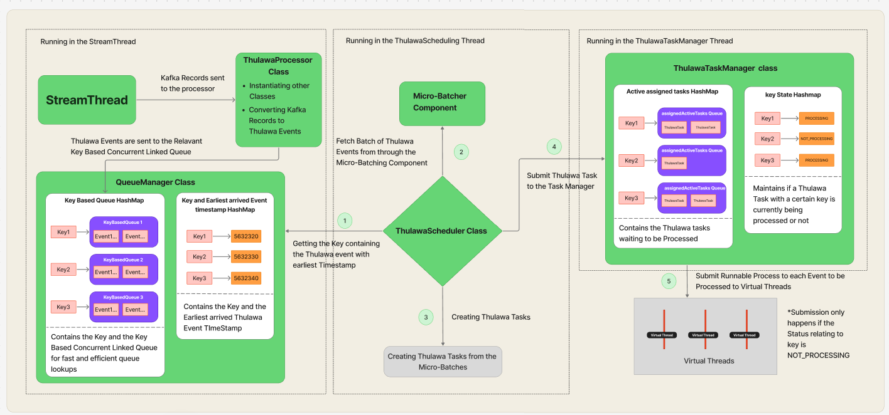

# Thulawa Task Processing System

This repository contains the implementation of the **Thulawa Task Processing System**, a Kafka-based event processing architecture using **virtual threads** for efficient task execution.

## 📌 Architecture Overview

The system consists of three main components running in separate threads:

1️⃣ **StreamThread** - Reads Kafka records, processes them into Thulawa events, and queues them based on keys.  
2️⃣ **ThulawaSchedulingThread** - Batches events, schedules tasks, and submits them to the task manager.  
3️⃣ **ThulawaTaskManagerThread** - Manages active tasks, tracks key states, and submits runnable processes to virtual threads.

## 🛠️ Components

### **1. StreamThread**
- Reads **Kafka records** and converts them into **Thulawa events** via the `ThulawaProcessor Class`.
- Sends events to a **Key-Based Concurrent Linked Queue**, managed by the `QueueManager Class`.

### **2. QueueManager Class**
- Maintains a **HashMap of Key-Based Queues** for efficient event retrieval.
- Stores the **earliest event timestamps** to prioritize event processing.

### **3. ThulawaScheduler Class**
- Fetches a **batch of events** via the **Micro-Batcher Component**.
- Identifies the **earliest timestamp event** for scheduling.
- Creates **Thulawa Tasks** from micro-batches.

### **4. ThulawaTaskManager Class**
- Maintains an **Active Assigned Tasks HashMap** to track pending tasks.
- Uses a **Key State HashMap** to determine if a key is currently being processed.
- Submits runnable processes to **Virtual Threads**, ensuring key-based processing.

## 🧵 Virtual Thread Processing
- **Tasks are only submitted** if the key is marked as `NOT_PROCESSING`.
- This ensures **efficient and parallel execution** without redundant processing.

## 🖼️ System Diagram


## 🚀 Key Features
✅ **Kafka-based event processing**  
✅ **Micro-batching for optimized scheduling**  
✅ **Key-based event queuing for ordered processing**  
✅ **Java Virtual Threads for high concurrency**

## 🏗️ Setup & Installation
```bash  
git clone https://github.com/your-repo/thulawa-task-processor.git  
cd thulawa-task-processor  
mvn clean install  
```

## 📝 License
This project is licensed under the MIT License - see the [LICENSE](LICENSE) file for details.
